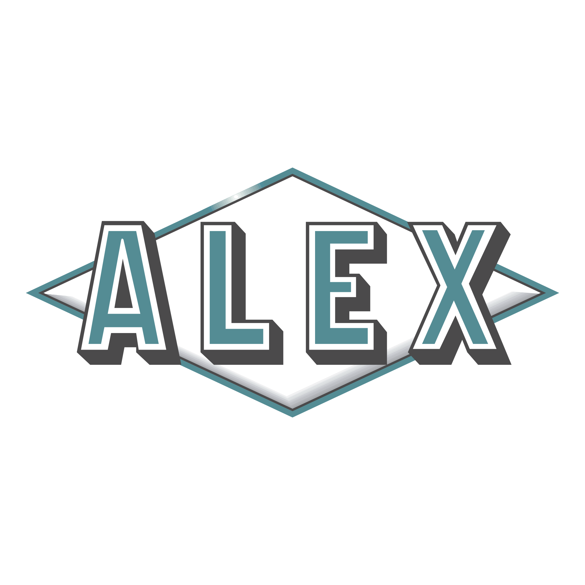

## Привет! Мне 24 года и я веб разработчик 👨‍💻 
> Моя цель - адаптивный, кроссбраузерный, читабельный код. 
>> Нахожусь в постоянном развитий и обучений , прохожу курсы, посещаю конференций. 
>>> Создаю функциональные интерактивные веб сайты, адаптивные на всех платформах и устройствах.

* 🎓 Заканчиваю курсы веб-разработчика в яндекс практикум.🎓
* 👌 Свой путь разработчика я начал в конце 2020 года!👌
* 🇺🇸 С 2021 года изучаю Английский язык!🇺🇸

### 🔥 Единственный способ делать отличную работу - любить то, что делаешь. И черт возьми это имменно то что я люблю!🔥

## МОЙ СТЕК ТЕХНОЛОГИЙ

## МОИ КОНТАКТЫ

